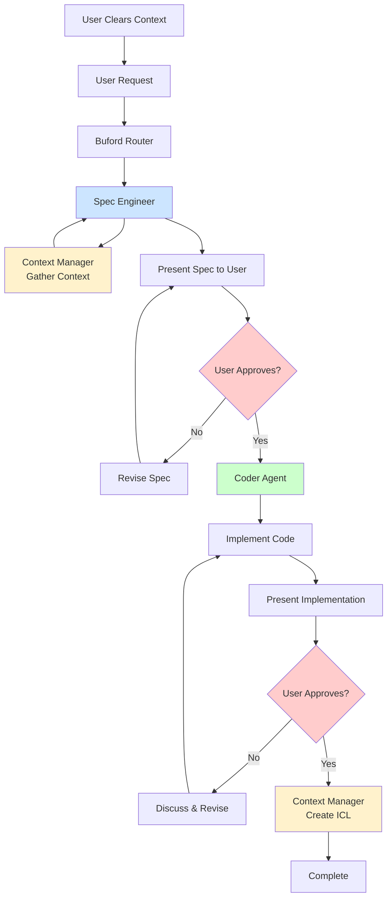

Buford - Multi-Agent Development System 

> A minimalistic Claude-based multi-agent system designed for specification-driven development.


## Overview

Buford is a structured multi-agent system built on Claude Code that enforces a strict specification-first workflow. Named after the internet meme dog, Buford coordinates between specialized agents to ensure clean, documented, and maintainable code development.

## Target Projects

Buford works best for small to mid size projects. 

## Dependencies

Buford has very little dependencies:
- Claude Code (although it is very easy to adapt to other ai coding tools)
- git
- bash

See the [History](#history) section below for more details on how this came to life.


### Core Philosophy
- **Strictly Spec-Driven** - Ideally you do not have to manually write code anymore, and very rarely read it. All interaction is handled through specifications.
- **Human-In-The-Loop Approach** - buford does not attempt to automate development completely. It deliberately asks the user for approval at certain points (see Workflow below)
- **Optimized for Context** - File based context system to avoid hallucinations (see [History](#history) for details)

### History

In the beginning of 2025, I was working as a contractor for a large household device manufacturer. My job was to work on the ultimate ai assisted developer workflow. I read every paper and every blog I could find about programming with AI. This broad analysis resulted in a number of key insights:

1. Try to avoid using more than 40% of the context window of any LLM. That's the decay threshold. After that, pretty much all LLM start to hallucinate or at least fail to find specific "needles in the haystack". The following insights are an immediate result of this:
   * Using subagents is a viable way to reduce context, since each subagent has it's own context window
   * Developing in short iterations keeps the context small
2. A memory system is a must. It greatly reduces the amount of context and also increases speed and correctness. Without a memory system, the LLM starts each task by grepping through all files trying to find context.
3. Specs are the new programming language. Handle LLM like a spec compiler.
4. Specs are the new programming language. Be methodical when writing specs. Here are just a few tips :
   * Use a DSL (Domain Specific Language). If you call a thing "Foo" in one spec, call it "Foo" in all subsequent ones, and do not wonder about bad results if you call it "Bar".
   * An LLM is trained to produce. If you want it to not produce in certain cases, you have to be explicit about it. 
5. Be mindful of MCP servers:
   * MCP servers add tools or function calling to the LLM. It might be tempting to add a lot of MCP servers. Do not do it. Research clearly shows that having too many tool to call confuses the LLM (sweet spot seems to be below 20 tool calls). Subagents can mitigate this, i.e. restricting certain MCP servers to certain subagents.
   * MCP servers are slow. For example, I prefer to allow buford to use git from the CLI instead of using a github MCP server. It's so much faster.
   * MCP servers have security and privacy issues. Make sure that you trust the MCP servers you are using.

Anyway, all this work resulted in a complex setup with multiple subagents, MCP servers, semantic RAG systems, a Graph database for finding all kinds of relations between code and files and entities, etc.

It worked, but was "heavy". Most small- to mid-sized projects do not want to have to run a postgresql and a neo4j instance just to be able to do their daily development work.

That's when Buford was born. It is a drastic simplification of the above system. it uses only the file system for context and specs, has no MCP server per default, and uses the git CLI to generate commits through a Claude Code custom command. 

## ICL format
The **ICL (Intentional Context Log) format** is a structured markdown file used to capture the context, decisions, and rationale behind significant development milestones. Each ICL file is timestamped and stored in `specs/context/`. The format ensures traceability and helps agents (and humans) understand why and how changes were made.

### ICL File Structure

Each ICL file follows the template below:

```markdown
# Intentional Context Summary

## Metadata
- **Timestamp:** {ISO8601}
- **Author/Agent:** {agent_name}
- **Task / Intent:** {description}

## Key Decisions
- List major decisions made during this milestone.

## Implementation Summary
- Summarize what was implemented or changed.

## References
- Link to related specs, research, or code.

## Next Steps / Open Questions
- List pending actions or unresolved issues.
```

**Key points:**
- **One ICL per milestone:** Create a new ICL after each significant implementation or decision.
- **Approval required:** Always wait for explicit user approval before finalizing and storing an ICL.
- **Traceability:** Reference related specs and research for full context.
- **Naming:** Use ISO8601 UTC timestamps for filenames, e.g., `2025-01-15T14-30.md`.

This format ensures that every important change is documented, reviewed, and easy to audit.

## Directory Structure

```
Buford/
├── .claude/
│   ├── agents/                 # Agent definitions
│   │   ├── buford.md          # Router agent
│   │   ├── coder.md           # Implementation agent
│   │   ├── context_manager.md  # Context & ICL agent
│   │   ├── spec_engineer.md    # Specification agent
│   │   └── web_researcher.md   # Research agent
│   └── commands/
│       └── commit.md          # Git commit workflows
├── specs/
│   ├── context/               # ICL context files (timestamped)
│   ├── specs/                 # Feature specifications
│   ├── static/                # Research & reference docs
│   └── templates/
│       ├── icl-template.md    # ICL file template
│       └── spec-template.md   # Specification template
├── CLAUDE.md                  # Critical workflow rules
├── README.md                  # This file
└── buford.png               # Buford avatar (currently broken)
```

## Subagent System

### 🟠 Buford (Router Agent)
**Primary interface and traffic coordinator**

- **Purpose**: Analyzes user requests and routes to appropriate specialized agents
- **When to use**: Default agent when no other is explicitly mentioned
- **Key function**: Intent detection and agent selection
- **Output format**: `@agent_name user_request`

### 🔵 Spec Engineer
**Specification writer and requirements clarifier**

- **Purpose**: Translates high-level intent into structured feature specifications
- **Responsibilities**:
  - Ask clarifying questions for ambiguous requests
  - Create specs in `specs/specs/` using the template
  - Link to relevant research and context files
  - Wait for explicit user approval before handoff
- **Critical rule**: NEVER proceeds to implementation without approved spec

### 🟢 Coder
**Implementation specialist**

- **Purpose**: Generates, reviews, and refactors code based on approved specifications
- **Prerequisites**: MUST have an approved spec before any implementation
- **Responsibilities**:
  - Generate code following project patterns and conventions
  - Write unit tests by default (except pure UI code)
  - Split files when they become too large
  - Follow 80/20 readability principle
- **Quality standards**: Component-based architecture, files under ~300 lines

### 🟡 Context Manager
**Context provider and ICL file creator**

- **Two main functions**:
  1. **Providing context**: Reads latest context files before other work
  2. **Creating context**: Generates ICL files after implementation milestones
- **File naming**: Uses ISO8601 timestamps (`date -u +"%Y-%m-%dT%H-%M"`)
- **Critical rule**: Always awaits user approval before finalizing ICL files

### 🟡 Web Researcher
**External information gatherer**

- **Purpose**: Searches web for authoritative sources and technical references
- **Process**: Search → Clean → Summarize → Store in `specs/static/`
- **Output**: Structured markdown with timestamps, sources, and extracted details
- **Priority**: Official documentation over forums or unverified sources

## Workflow



### Critical Rules ⚠️
- **ALWAYS clear the context before starting a new spec**
- **NEVER skip the spec writing phase**
- **NEVER implement before spec approval**
- **NEVER use coder agent without an approved spec**
- **ALWAYS wait for explicit approval after presenting a spec**
- **Never write ICL before user has approved coding step**

## Usage Examples

### Starting a New Feature
```
# User initiates with Buford
@buford lets crank up the next spec: "OAuth authentication". 
Check this link for reference: https://clerk.com/docs/custom-flows/oauth-connections 
and implement oauth authentication <rest of your requirements here>...
```

* Buford will tell the spec_engineer to write a spec according to the template and will automatically use the web researcher agent to read the spec. 
* After that, Buford will ask to you to review the generated spec and approve it or provide corrections. 
* Once you approve, Buford will hand over to the coder for implementation. 
* Once finished, Buford will again ask you to test the new features and approve or comment. 
* When you approve, the spec_engineer will write the ICL file. 
* After that you can use the ```/commit``` command to commit the change.


## Templates

### Specification Template
All specs follow the structure in `specs/templates/spec-template.md`:

```markdown path=null start=null
# Feature Specification

## Metadata
- **Timestamp:** {ISO8601}
- **Author/Agent:** {Spec Engineer}
- **Feature / Task:** {description}

## Problem Statement
## Goals & Requirements
## Non-Goals / Constraints
## Proposed Approach
## Dependencies / References
## Acceptance Criteria
```

### ICL Template
Context files follow `specs/templates/icl-template.md`:

```markdown path=null start=null
# Intentional Context Summary

## Metadata
- **Timestamp:** {ISO8601}
- **Author/Agent:** {agent_name}
- **Task / Intent:** {description}

## Key Decisions
## Implementation Summary
## References
## Next Steps / Open Questions
```

