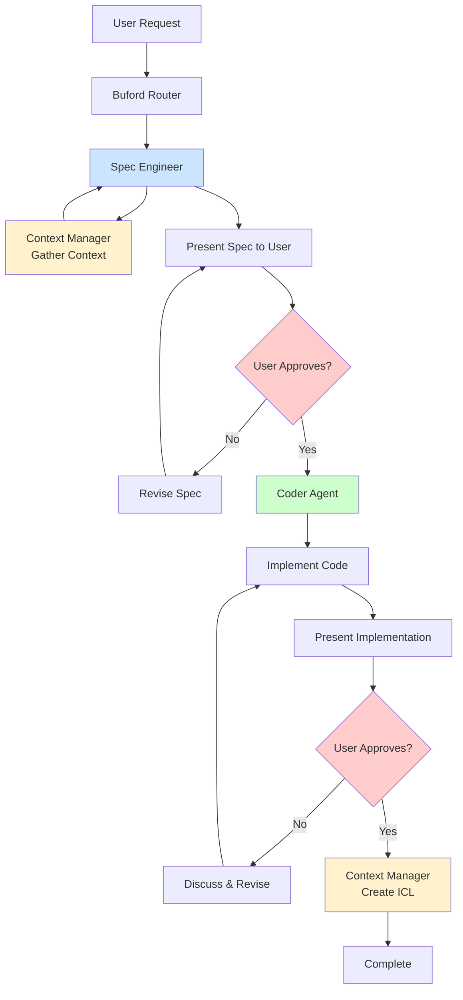

Buford - Multi-Agent Development System 

> A Claude-based multi-agent system designed for specification-driven development.


## Overview

Buford is a structured multi-agent system built on Claude that enforces a strict specification-first workflow. Named after the internet meme dog, Buford coordinates between specialized agents to ensure clean, documented, and maintainable code development.

### Core Philosophy
- **Code is written to be read by humans** - prioritizing clarity and understanding
- **Specification-driven development** - no implementation without approved specs
- **Intentional Context Layering (ICL)** - maintaining rich context for future development
- **Anti-documentation rot** - keeping docs current and expanding when necessary

## Directory Structure

```
Buford/
├── .claude/
│   ├── agents/                 # Agent definitions
│   │   ├── buford.md          # Router agent
│   │   ├── coder.md           # Implementation agent
│   │   ├── context_manager.md  # Context & ICL agent
│   │   ├── spec_engineer.md    # Specification agent
│   │   └── web_researcher.md   # Research agent
│   └── commands/
│       └── commit.md          # Git commit workflows
├── specs/
│   ├── context/               # ICL context files (timestamped)
│   ├── specs/                 # Feature specifications
│   ├── static/                # Research & reference docs
│   └── templates/
│       ├── icl-template.md    # ICL file template
│       └── spec-template.md   # Specification template
├── CLAUDE.md                  # Critical workflow rules
├── README.md                  # This file
└── buford.png               # Buford avatar (currently broken)
```

## Agent System

### 🟠 Buford (Router Agent)
**Primary interface and traffic coordinator**

- **Purpose**: Analyzes user requests and routes to appropriate specialized agents
- **When to use**: Default agent when no other is explicitly mentioned
- **Key function**: Intent detection and agent selection
- **Output format**: `@agent_name user_request`

### 🔵 Spec Engineer
**Specification writer and requirements clarifier**

- **Purpose**: Translates high-level intent into structured feature specifications
- **Responsibilities**:
  - Ask clarifying questions for ambiguous requests
  - Create specs in `specs/specs/` using the template
  - Link to relevant research and context files
  - Wait for explicit user approval before handoff
- **Critical rule**: NEVER proceeds to implementation without approved spec

### 🟢 Coder
**Implementation specialist**

- **Purpose**: Generates, reviews, and refactors code based on approved specifications
- **Prerequisites**: MUST have an approved spec before any implementation
- **Responsibilities**:
  - Generate code following project patterns and conventions
  - Write unit tests by default (except pure UI code)
  - Split files when they become too large
  - Follow 80/20 readability principle
- **Quality standards**: Component-based architecture, files under ~300 lines

### 🟡 Context Manager
**Context provider and ICL file creator**

- **Two main functions**:
  1. **Providing context**: Reads latest context files before other work
  2. **Creating context**: Generates ICL files after implementation milestones
- **File naming**: Uses ISO8601 timestamps (`date -u +"%Y-%m-%dT%H-%M"`)
- **Critical rule**: Always awaits user approval before finalizing ICL files

### 🟡 Web Researcher
**External information gatherer**

- **Purpose**: Searches web for authoritative sources and technical references
- **Process**: Search → Clean → Summarize → Store in `specs/static/`
- **Output**: Structured markdown with timestamps, sources, and extracted details
- **Priority**: Official documentation over forums or unverified sources

## Mandatory Workflow



### Critical Rules ⚠️
- **NEVER skip the spec writing phase**
- **NEVER implement before spec approval**
- **NEVER use coder agent without an approved spec**
- **ALWAYS wait for explicit approval after presenting a spec**
- **Never write ICL before user has approved coding step**

## Usage Examples

### Starting a New Feature
```
# User initiates with Buford
@buford I need OAuth2 authentication for the API

# Buford routes to spec engineer
@spec_engineer I need OAuth2 authentication for the API

# Spec engineer gathers context and creates spec
# After user approval, implementation begins
@coder Implement the OAuth2 authentication per approved spec
```

### Research-Heavy Features
```
# For features requiring external research
@buford I need to implement WebRTC for video calls

# May route through web researcher first
@web_researcher Research WebRTC implementation best practices

# Then proceed through normal workflow
@spec_engineer Create spec for WebRTC implementation based on research
```

## Templates

### Specification Template
All specs follow the structure in `specs/templates/spec-template.md`:

```markdown path=null start=null
# Feature Specification

## Metadata
- **Timestamp:** {ISO8601}
- **Author/Agent:** {Spec Engineer}
- **Feature / Task:** {description}

## Problem Statement
## Goals & Requirements
## Non-Goals / Constraints
## Proposed Approach
## Dependencies / References
## Acceptance Criteria
```

### ICL Template
Context files follow `specs/templates/icl-template.md`:

```markdown path=null start=null
# Intentional Context Summary

## Metadata
- **Timestamp:** {ISO8601}
- **Author/Agent:** {agent_name}
- **Task / Intent:** {description}

## Key Decisions
## Implementation Summary
## References
## Next Steps / Open Questions
```

## Best Practices

### Development Guidelines
- **Unit tests by default** - except for pure UI code
- **Split large files** - improves code quality and readability
- **Component-based architecture** - keep files manageable (~300 lines)
- **Follow existing patterns** - adhere to established project conventions

### Documentation Maintenance
- **Keep README current** - expand when adding new features
- **Update diagrams** - when workflow changes
- **Review templates** - ensure they match current practices
- **Check file references** - verify links and paths remain valid

### Context Management
- **Read recent context** - always check `specs/context/` before starting work
- **Create ICL files** - document decisions and implementations
- **Reference external docs** - link to research in `specs/static/`
- **Maintain traceability** - connect specs to implementations to context

## Anti-Documentation Rot

To prevent documentation from becoming outdated:

### Contributor Checklist
- [ ] README reflects current agent capabilities
- [ ] Workflow diagram matches actual process
- [ ] Templates are up-to-date with current practices
- [ ] Examples use current syntax and patterns
- [ ] Links and file references are valid

### Maintenance Schedule
- **After major changes**: Update relevant documentation sections
- **Monthly review**: Check for broken links and outdated examples
- **Quarterly audit**: Comprehensive review of all documentation

## Git Workflow

The system includes automated commit guidance via `.claude/commands/commit.md`:
- **Atomic commits** - group logically related changes
- **Imperative messages** - "Add X", "Update Y", "Refactor Z"
- **Focus on intent** - capture reasoning, not just mechanical changes
- **User ownership** - commits attributed to user, not AI

## Contributing

1. **Follow the workflow** - use the mandatory agent sequence
2. **Write readable code** - remember the 80/20 principle
3. **Test by default** - create unit tests unless explicitly exempted
4. **Document decisions** - create ICL files for significant changes
5. **Keep docs current** - update README and relevant documentation

---

*Built with Claude and designed for human-readable development. Remember: code is written once but read many times.*
